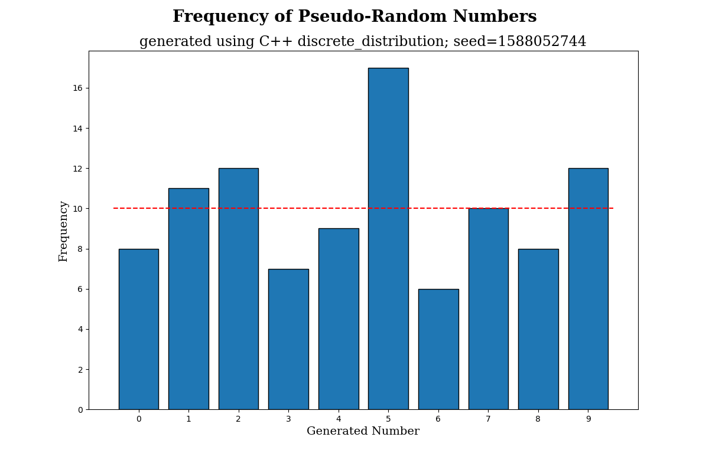

# Pseudo-Random-Number-Generators
Visualization, comparison, and analysis of some popular random number generators

## Overview
I have always been fascinated with the idea of "random" and how computer programs can never actually achieve true randomness. Recently, I was challenged to create a random number generator from scratch, and, with no prior experience, my generator did not have good results. But then, I started thinking about how to officially prove whether or not a random number generator is good.

After doing some research, I realized that this is a largely-studied field in computer science. One inuitive way to determine if a pseudo-random number generator is good is to use the chi-squared test. In actually testing the generator, I would perform a chi-squared test and then graph the data. I also decided to test some other generators including generators in the C++ random library. This respository aims to test just how random these pseudo-random number generators are.

In creating this project, I gained a much deeper understanding in the following aspects of computer science:
- Pseudo-random number generators
- Using the matplotlib-cpp library to graph data
- Function pointers and various data structures in C++
- Applying statistics that I learned in school to a real project

## Background

### Psuedo-Random Number Generators

Randomness is a vital part of nature: something as simple as a coin flip to something as complex as radioactive decay both contain the concept of randomness in the real world. However, a computer program cannot replicate the true randomness of nature. Instead, random numbers generated by computers are actually pseudo-random, calculated using a mathematical equation, some constants, and an initial seed value. The seed value is has to be an integer, and often the current time is used. These mathematical equations use recursion to calculate one number based on the previous one, and often include the modulus operator for smaller results.

One example of a popular pseudo-random number generator is the linear congruential generator, which takes on the form , where *m*, *a*, and *c* are integer constants. The seed value, which is also an integer, is . The linear congruential generator, like other pseudo-random number generators, will never provide true randomness because we can always predict the next value by solving the equation.

### Chi-Squared Test

The Chi-Squared test is a statistical test to determine how well a dataset of discrete, categorical variables are related to each other. We can compare the observed values to the expected values and see if there is a statistically significant difference using the following formula:


In the context of random numbers, each category, or bucket, is the random number, between 0 and 9, inclusive. Ideally, as the number of random numbers calculated increases, the dataset should have a uniform distribution. In other words the expected value, , should always be the number of tests divided by the number of categories (10 categories).

If the chi-squared statistic is close to 0, that means that the dataset is very close to uniform distribution. However, if the statistic is too high, that means that the differences cannot be accounted for by random variation in the data. To calulate the the critical value, we need to find the degrees of freedom and the determine an alpha value. Using a chi-squared table, we know that the critical value is 16.919.

For this project, the PRNG is good if its chi-squared statistic is below 16.919.

### This Project

For this project, I wanted to see how efficient each pseudo-random number generator is, and graph the results. To do this, we first determine which generator to use, the number of tests to run, and the seed; we get all this information from the command line arguments. Then, using function pointers that correspond to the selected generator, we run a function that generates many random numbers. Then, the function stores those results in a vector with indicies from 0 to 9. For generators that do not return a number from 0 to 9, we use the modulus operator. Offcially, the modulus operator does not truly analyze the randomness of the number, but for our purposes, this method works. Then, we use the vector to create a bar graph with the frequency of the numbers using matplotlib-cpp. We use that library for styling the graph, then save it as a .png file.

After graphing the numbers, we can perform a statistical analysis of the results. We need to perform a chi-squared test using the expected number of times for a number of be generated and the actual number of times the number was generated. We know that we have 9 degrees of freedom in this test, and we set the alpha value to 0.05. This means that the critical value is 16.919. Now, we can compare the chi-squared statistic to the critical value. If the chi-squared statistic is below 16.919, that means the generator is good, and whatever slight differents between that data and a uniform distribution can be accounted for by random variations. However, if the chi-squared statistic is above 16.919, that means that the generator does not produce good results, and is therefore bad.

## Demonstration and Analysis

### C++ rand

|  | 100 Numbers | 10,000 Numbers |
| :---: | :---: | :---: |
| Graph   |  | |
| Statistics| Using C++ rand.<br/>The random number seed is 1587700084.<br/>Running 100 tests.<br/>Χ² = 16.6.<br/>A good generator's Χ² should be below 16.919.<br/>This generator's Χ² is 16.600.<br/>Based on this test, the C++ rand is a good generator. | Using C++ rand.<br/>The random number seed is 1587700103.<br/>Running 10000 tests.<br/>Χ² = 9.342.<br/>A good generator's Χ² should be below 16.919.<br/>This generator's Χ² is 9.342.<br/>Based on this test, the C++ rand is a good generator.|

### C++ uniform_int_distribution

|  | 100 Numbers | 10,000 Numbers |
| :---: | :---: | :---: |
| Graph   |  | |
| Statistics| Using C++ uniform_int_distribution.<br/>The random number seed is 1587700112.<br/>Running 100 tests.<br/>Χ² = 7.<br/>A good generator's Χ² should be below 16.919.<br/>This generator's Χ² is 7.000.<br/>Based on this test, the C++ uniform_int_distribution is a good generator. | Using C++ uniform_int_distribution.<br/>The random number seed is 1587700126.<br/>Running 10000 tests.<br/>Χ² = 12.066.<br/>A good generator's Χ² should be below 16.919.<br/>This generator's Χ² is 12.066.<br/>Based on this test, the C++ uniform_int_distribution is a good generator. |

### C++ discrete_distribution

|  | 100 Numbers | 10,000 Numbers |
| :---: | :---: | :---: |
| Graph   |  | |
| Statistics| Using C++ discrete_distribution.<br/>The random number seed is 1588052744.<br/>Running 100 tests.<br/>Χ² = 9.2.<br/>A good generator's Χ² should be below 16.919.<br/>This generator's Χ² is 9.200.<br/>Based on this test, the C++ discrete_distribution is a good generator. | Using C++ discrete_distribution.<br/>The random number seed is 1588052748.<br/>Running 10000 tests.<br/>Χ² = 10.67.<br/>A good generator's Χ² should be below 16.919.<br/>This generator's Χ² is 10.670.<br/>Based on this test, the C++ discrete_distribution is a good generator. |

### Neha Deshpande's Homemade PRNG

|  | 100 Numbers | 10,000 Numbers |
| :---: | :---: | :---: |
| Graph   |  | |
| Statistics| Using Neha Deshpande's Homemade PRNG.<br/>The random number seed is 1598787956.<br/>Running 100 tests.<br/>Χ² = 4.4.<br/>A good generator's Χ² should be below 16.919.<br/>This generator's Χ² is 4.400.<br/>Based on this test, Neha Deshpande's Homemade PRNG is a good generator. | Using Neha Deshpande's Homemade PRNG.<br/>The random number seed is 1598788433.<br/>Running 10000 tests.<br/>Χ² = 541.232.<br/>A good generator's Χ² should be below 16.919.<br/>This generator's Χ² is 541.232.<br/>Based on this test, Neha Deshpande's Homemade PRNG is a bad generator. |

### Crappy Homemade PRNG (cyclic)

|  | 100 Numbers | 10,000 Numbers |
| :---: | :---: | :---: |
| Graph   |  | |
| Statistics| Using Crappy Homemade PRNG.<br/>The random number seed is 1598788097.<br/>Running 100 tests.<br/>Χ² = 0.<br/>A good generator's Χ² should be below 16.919.<br/>This generator's Χ² is 0.000.<br/>Based on this test, Crappy Homemade PRNG is a good generator. | Using Crappy Homemade PRNG.<br/>The random number seed is 1598788427.<br/>Running 10000 tests.<br/>Χ² = 0.<br/>A good generator's Χ² should be below 16.919.<br/>This generator's Χ² is 0.000.<br/>Based on this test, Crappy Homemade PRNG is a good generator. |

### C++ piecewise_constant_distribution

|  | 100 Numbers | 10,000 Numbers |
| :---: | :---: | :---: |
| Graph   |  | |
| Statistics| Using C++ piecewise_constant_distribution.<br/>The random number seed is 1598786124.<br/>Running 100 tests.<br/>Χ² = 7.6.<br/>A good generator's Χ² should be below 16.919.<br/>This generator's Χ² is 7.600.<br/>Based on this test, the C++ piecewise_constant_distribution is a good generator. | Using C++ piecewise_constant_distribution.<br/>The random number seed is 1598789615.<br/>Running 10000 tests.<br/>Χ² = 4.696.<br/>A good generator's Χ² should be below 16.919.<br/>This generator's Χ² is 4.696.<br/>Based on this test, C++ piecewise_constant_distribution is a good generator. |

## Installation and Running Instructions
1. Download and unzip [this repository](https://github.com/neha-deshpande001/Pseudo-Random-Number-Generators/archive/master.zip)

2. Compile ```PRNG.cpp```
```
g++ *.cpp -std=c++11 -I/usr/include/python2.7 -lpython2.7
```

3. Run the program with the following command line arguments
```
./a.out [numTests] [type] [seed]
```
where:
- [numTests] is an integer number of tests to run
- [type] is the type of PRNG to use to perform those tests. The types that are supported as of 4/34/2020 are:
  - "rand"
  - "uniform_int_distribution"
  - "discrete_distribution"
- [seed] is the initial seed to use in the generator. The seed can be:
  - "time"
  - an integer number

## Resources
- matplotlib-cpp - https://github.com/lava/matplotlib-cpp
- Testing a Random Number Generator - https://www.johndcook.com/Beautiful_Testing_ch10.pdf
- Analysis of an On-line Random Number Generator - https://www.random.org/analysis/Analysis2001.pdf
- Linear congruential generator - https://en.wikipedia.org/wiki/Linear_congruential_generator
- C++ random - http://www.cplusplus.com/reference/random/
- random.org - https://www.random.org/randomness/
- Chi-squared test - https://www.statisticshowto.com/probability-and-statistics/chi-square/
